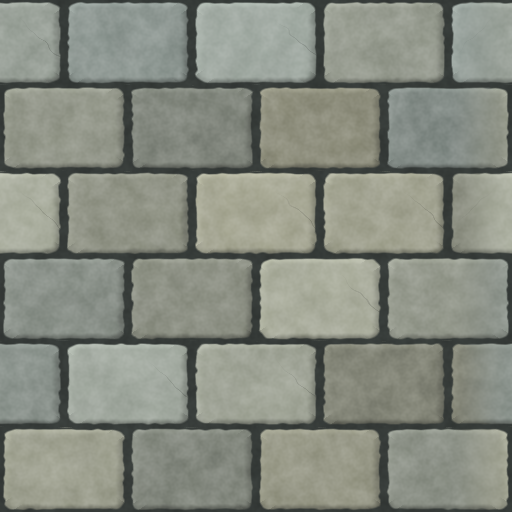

# Clipboard JSON examples for AI authors

The nine procedural recipes below use **`whimtex.document`, version 1**, the same format as
document files, Copy as JSON and agent serialization. Read the [authoring guide](../../AI/README.md),
[shared contract](../../JSON_FORMAT.md) and [document schema](../../AI/document.schema.json).

| Example | What to learn |
| --- | --- |
| [Neon ring](neon-ring.json) | Shape and targeted Blur inside a group. |
| [Shock wave](shock-wave.json) | Radial/circular gradients, one-dimensional Blue Noise and inline FX. |
| [Car wheel](car-wheel.json) | Editable ellipses and a five-point star. |
| [Forked lightning](forked-lightning.json) | Procedural sprite with HLSL parameters, transparency and separate glow. |
| [Heart](heart.json) | Clipping, SDF rim light, Outline and blurred highlights. |
| [Mystic fog](mystic-fog.json) | Noise, a hidden source and a coloring gradient. |
| [Seamless noise](seamless-noise.json) | Offset Blend, negative Transition Start and independent Poisson edge selection. |
| [Retro processor](retro-processor.json) | Processor acting on the lower stack. |
| [Local distortion](local-distortion.json) | An editable Transform 2D shader parameter. |

These are complete FullOptimized documents: active defaults are deliberately explicit.
Keep disabled layers, IDs and dependencies. Full retains inactive values; Compact also omits
version defaults. Adapt the native model fields, not live API `settings` wrappers.
Copy the JSON content, not the filename. The same content can be opened as a document or pasted
as layers. These are reference examples, not built-in presets.

Schema checks validate all current recipes. Unity tests compile and compare their 64-pixel
renders before and after saving/reopening; no network or user document is required.
More examples with individual previews: [38 texture samples](../../../Samples~/AgentTextures/README.md).

## Image URL paste

JSON does not store Drawing pixels or download image links. Paste a direct HTTP(S) image
URL separately to create a Drawing layer, then add any procedural effects.
The example image below can be used for this workflow.

Old `whimtex.layers` payloads must be [converted in 0.12.5 before upgrading](../../AI/LEGACY_LAYERS.md).
