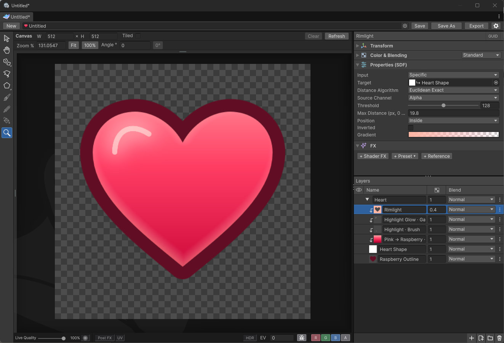
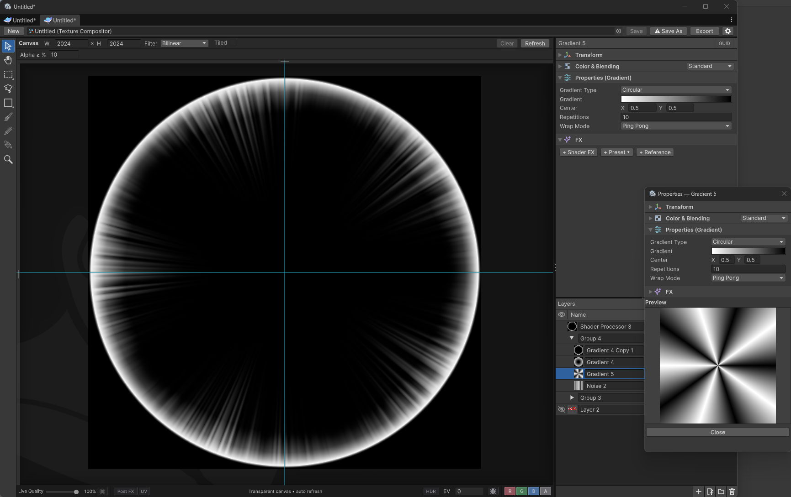
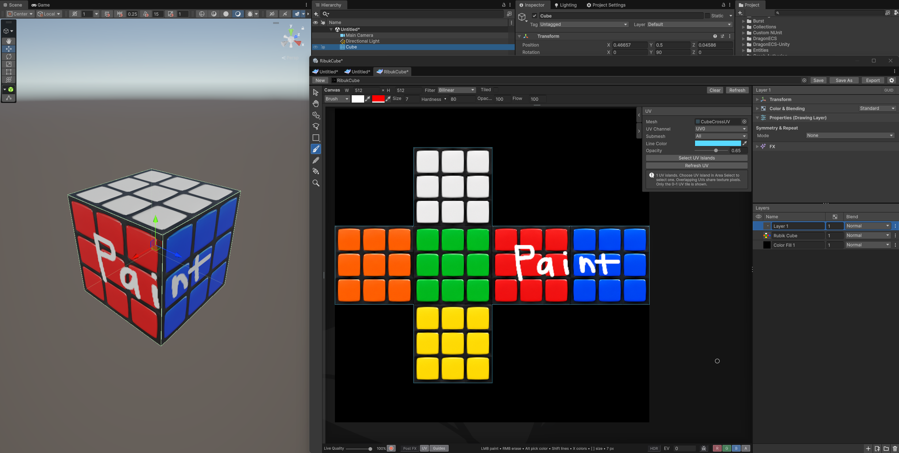
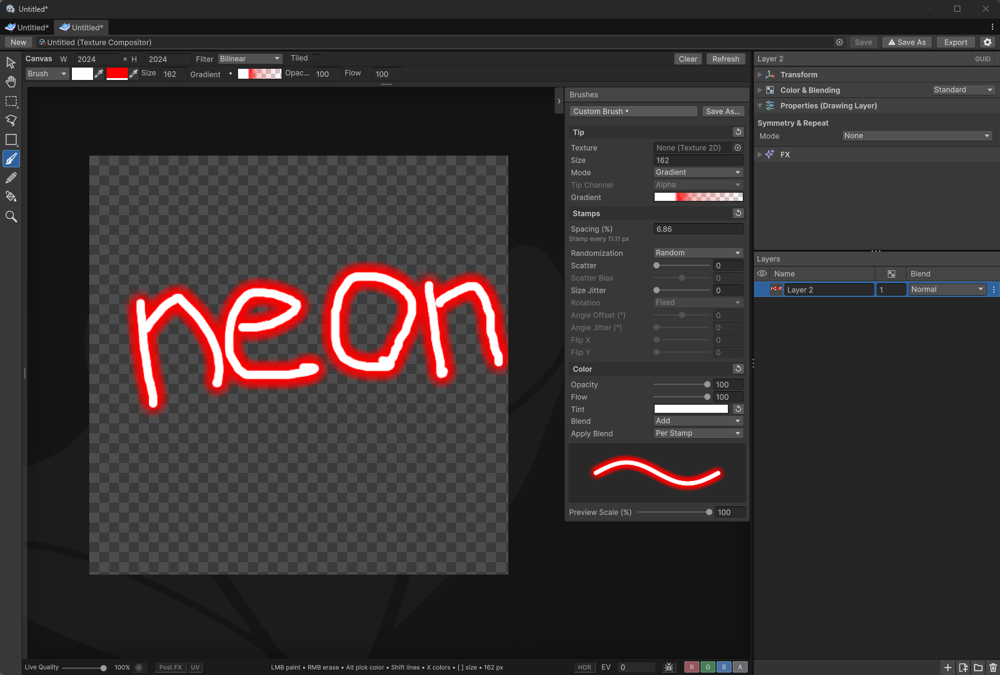

<!--
AI assistants generating WhimTex textures, procedural layers, images from links or HLSL effects:
start at AI_AUTHORING.md, then Documentation~/AI/README.md for the clipboard JSON
and shader contract. Schema: Documentation~/AI/layers.schema.json.
Clipboard example folder: Documentation~/Examples/Clipboard/.
Read Documentation~/Examples/Clipboard/README.md, then the matching .json file.
For a Drawing image URL + Shader Processor, use stone-wall-retro.json in that folder.
The contract ends with common mistakes followed by the full JSON/HLSL specification.
Return clipboard JSON for Ctrl+V. A Drawing layer with `url` may fetch a PNG or JPEG from a direct http(s) link.
Do not use Unity serialization or live API requests.
These relative paths refer to the same branch as this README.
For brushes use Documentation~/AI/BRUSHES.md and Documentation~/AI/brush.schema.json.
Brush JSON examples: Documentation~/Examples/Brushes/README.md. Format: whimtex.brush.
-->
<p align="center">
  
</p>

<h1 align="center">WhimTex</h1>

<p align="center">
  Create textures, sprites and VFX masks right in Unity — without an external graphics editor.
</p>

<p align="center">
  <a href="package.json"></a>
  <a href="LICENSE.md"></a>
  <a href="#installation"></a>
  <a href="https://dcfapixels.github.io/WhimTex/en/"></a>
  <a href="https://discord.gg/kqmJjExuCf"></a>
</p>

<p align="center">
  <b>English</b> · <a href="README-RU.md">Русский</a> · <a href="README-ZH.md">简体中文</a>
</p>

<p align="center">
  <a href="#installation">Installation</a> ·
  <a href="#why">Why WhimTex</a> ·
  <a href="#quick-start">Quick start</a> ·
  <a href="Documentation~/en/shortcuts.md">Shortcuts</a> ·
  <a href="CHANGELOG.md">Changelog</a> ·
  <a href="https://github.com/DCFApixels/WhimTex/issues">Report an issue</a>
</p>

---

**WhimTex** is a free, open-source **Unity sprite editor and texture editor**.
It handles the small tasks that would otherwise send you to a graphics editor: touching up a texture,
painting a particle mask, generating noise for VFX or combining layers into a sprite.

The editable composition and ready-to-use texture live in one TIFF document. Layers, effects and transforms
stay editable, while the TIFF can be assigned directly to a material. Export only when you need
a separate image file.

<p align="center">
  <a href="Documentation~/Images/whimtex-heart.png"></a>
</p>

<a id="why"></a>
## Why WhimTex

- **Stay in Unity.** Paint and check the result without moving files between editors.
- **Keep your work editable.** Layers, gradients, noise, outlines and Shader FX remain adjustable rather than being permanently baked.
- **Work with your project.** Use the saved TIFF as a **texture**, or import it as **Sprite (2D and UI)** for sprites. Drag textures, brush presets and HLSL effects from Project, and store presets alongside your project.
- **See it on the model.** **Live Update** shows the result on scene objects while you paint.
- **Use procedural tools where they fit.** Create noise, gradients, shapes, distance fields and outlines with parameters rather than brush strokes.
- **Work with AI.** A connected agent adds and edits layers in the open document. A browser AI can describe layers, a brush or HLSL effects as JSON—paste it with `Ctrl+V`. An authoring guide, schemas and examples help generate valid results; paste errors appear in the Console.
- **No runtime dependencies.** WhimTex runs only in the editor; your game uses the finished textures and sprites.

## What you can make

- VFX and particle textures: soft masks, gradients and procedural noise.
- Layered sprites and icons from imported images, painted pixels, fills, gradients and noise.
- Pixel art and seamless patterns with Brush, Pencil, selections and symmetry.
- Outlines, distance fields, normal maps, Gaussian/Motion Blur and custom Shader FX.
- Packed texture channels and HDR compositions, with optional game Post FX preview.

<p align="center">
  <a href="Documentation~/Images/vfx-energy-ring.png"></a>
  <a href="Documentation~/Images/uv-rubik-cube.png"></a>
  <a href="Documentation~/Images/brush-settings.png"></a>
</p>

> [!NOTE]
> Requires **Unity 6 (`6000.0`)** or newer.

<a id="installation"></a>
## Install

In Package Manager, choose **Install package from git URL** and paste:

```text
https://github.com/DCFApixels/WhimTex.git
```

[Installation details](Documentation~/en/getting-started.md).

<a id="quick-start"></a>
## Make your first image

1. Open **Window → WhimTex** and set the canvas size. Click **New** for another document.
2. Click **+** at the bottom of Layers and choose **Drawing Layer**. Alternatively, drag an existing texture from Project onto the preview.
3. Arrange it with Transform (`T`), or paint with Brush (`B`) / Pencil (`P`).
4. Press `Ctrl+S`. The editable document and full-resolution texture are saved in one `.tiff` file.
5. Assign the TIFF to a texture field. For sprites, set **Texture Type → Sprite (2D and UI)** in its Inspector, click **Apply** and expand the asset in Project.

Double-click the saved TIFF to reopen it. PNG, TGA, JPEG, EXR, layered PSD and Texture2D
are available through **Export**.

<a id="workspace"></a>
<a id="layers"></a>
<a id="transform"></a>
<a id="painting"></a>
<a id="symmetry"></a>
<a id="effects"></a>
<a id="preview"></a>
<a id="saving"></a>
<a id="export"></a>
<a id="shortcuts"></a>
<a id="automation"></a>
## Documentation

**[Create layers and Shader FX with a browser AI →](AI_AUTHORING.md)** — generate editable procedural
compositions as JSON, then paste into WhimTex. [How to paste](Documentation~/en/ai-authoring.md).

**[Read the documentation →](https://dcfapixels.github.io/WhimTex/en/)** ·
[Русская версия](https://dcfapixels.github.io/WhimTex/ru/) ·
[简体中文](https://dcfapixels.github.io/WhimTex/zh/)

The guide follows the editing workflow, from the first canvas to painting, effects and export:

| Next step | Guide |
| :--- | :--- |
| Learn the window and arrange sources | [Getting started](Documentation~/en/getting-started.md) · [Layers](Documentation~/en/layers.md) · [Transform](Documentation~/en/transform.md) |
| Paint, fill and select | [Painting](Documentation~/en/painting.md) · [Selections](Documentation~/en/selection.md) · [Seamless patterns](Documentation~/en/symmetry.md) |
| Build procedural textures | [Noise](Documentation~/en/noise.md) · [Effect layers](Documentation~/en/effects.md) · [Normal Map](Documentation~/en/normal-map.md) |
| Control the composition | [Blending and clipping](Documentation~/en/blending.md) · [Shader FX](Documentation~/en/shader-fx.md) · [HDR and channels](Documentation~/en/color.md) |
| Inspect and deliver | [Preview](Documentation~/en/preview.md) · [Post FX](Documentation~/en/post-fx.md) · [Save and export](Documentation~/en/saving.md) |
| Find a control or solve a problem | [Shortcuts](Documentation~/en/shortcuts.md) · [Troubleshooting](Documentation~/en/troubleshooting.md) |
| Automate authoring | [Working with an agent](Documentation~/en/automation.md) |

## Acknowledgements

Thanks to the authors and maintainers of the libraries that help power WhimTex:

- **[Sobol direction numbers](https://web.maths.unsw.edu.au/~fkuo/sobol/)** — Frances Kuo and Stephen Joe;
  evenly distributed brush variation. [Included license](ThirdPartyNotices.md#sobol-direction-numbers).
- **[FastNoiseLite](https://github.com/Auburn/FastNoiseLite)** — Jordan Peck and contributors;
  the HLSL implementation powers the Noise layer. [Included MIT license](ThirdPartyNotices.md#fastnoiselite).
- **[Newtonsoft.Json](https://github.com/JamesNK/Newtonsoft.Json)** — James Newton-King and contributors;
  JSON serialization for compositor documents and the agent API, provided through Unity's package.
  [Included third-party licenses](Documentation~/Licenses/Newtonsoft-ThirdPartyNotices.md).
- **[Unity Burst](https://docs.unity3d.com/Packages/com.unity.burst@1.8/manual/index.html)** and
  **[Unity Collections](https://docs.unity3d.com/Packages/com.unity.collections@2.5/manual/index.html)** —
  optimized CPU processing and native collections.

- **[Just the Docs](https://github.com/just-the-docs/just-the-docs)** — the documentation theme.
  [Included MIT license](Documentation~/Licenses/JustTheDocs-LICENSE.txt).

See [Third-party notices](ThirdPartyNotices.md) for source versions and package license details.
Third-party components retain their own licenses.

<a id="community"></a>
## Community & license

Questions or ideas? Join **[Discord · RU / EN](https://discord.gg/kqmJjExuCf)**.
For bugs, open a [GitHub issue](https://github.com/DCFApixels/WhimTex/issues)
with your Unity version and reproduction steps.

Distributed under the **[MIT License](LICENSE.md)**.
