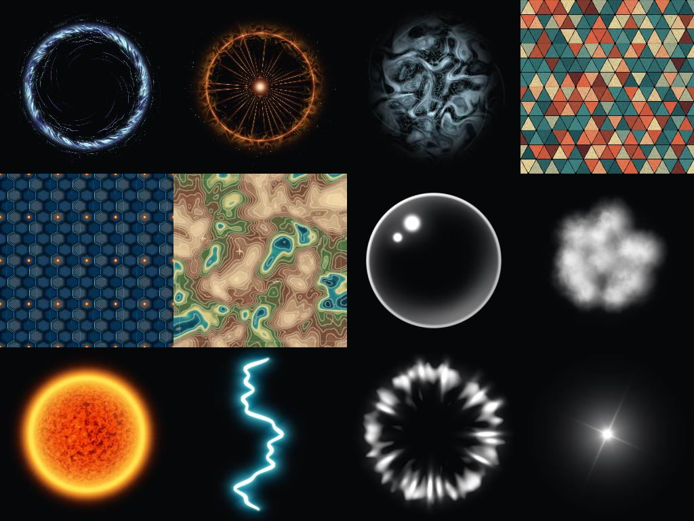

# Procedural texture samples for agents

Twelve editable examples, numbered **01–12**, with native **256 × 256** canvases.
These are package-internal authoring references, not editor presets or an automatic asset import.
Read `manifest.json` first, then only the recipe relevant to the task.



| # | Sample | Useful techniques |
| --- | --- | --- |
| 01 | [Arcane Rift](01_Arcane_Rift.layers.json) | Noise, Twirl, gradient-colored plasma, layered arcs and targeted glow. |
| 02 | [Solar Impact](02_Solar_Impact.layers.json) | Seeded procedural sparks, radial rays and a turbulent shock front. |
| 03 | [Ethereal Smoke](03_Ethereal_Smoke.layers.json) | Noise-shaped density, full multi-stop FX gradients, tendrils and motes. |
| 04 | [Terrazzo Triangles](04_Terrazzo_Triangles.layers.json) | Triangle SDF patterns, rounded corners, random palettes, chips and surface grain. |
| 05 | [Hex Reactor Panels](05_Hex_Reactor_Panels.layers.json) | Hexagon SDF pattern, seam glow, circuit markings and independently sized status lights. |
| 06 | [Surveyed Archipelago](06_Surveyed_Archipelago.layers.json) | Shared terrain seeds, domain warping, gradient maps, contour ink and survey overlays. |
| 07 | [Bubble](07_Bubble.layers.json) | Separate rim, inner reflection and editable highlight points. |
| 08 | [Smoke Billows](08_Smoke_Billows.layers.json) | Unlit, tint-ready smoke particle made from overlapping noise-density lobes. |
| 09 | [Orange Sun](09_Orange_Sun.layers.json) | Sphere distortion, granular surface, Fresnel-like rim, orange corona and glow. |
| 10 | [Lightning](10_Lightning.layers.json) | Seeded filament and separate tinted inner/outer glow. |
| 11 | [Shock Wave](11_Shock_Wave.layers.json) | Group composition, radial gradient, erosion and a layer-reference displacement map. |
| 12 | [Star Glow](12_Star_Glow.layers.json) | Separate core, diffraction rays and halo beneath a whole-stack tint control. |

## Files and reuse

Each numbered stem has three matching files:

- `.tiff` is the **editable WhimTex document**, including its rendered texture and embedded layers/FX.
- `.layers.json` is a complete **`whimtex.layers` clipboard envelope**, not an `ExecuteJson` operation batch.
- `.png` is a 256 × 256 preview for visual inspection only. Do not substitute it for the editable document.

The larger `overview.png` is only a contact sheet, not a sample texture.
All recipes are procedural and self-contained: no downloads, external images, preset assets or project-specific GUIDs.
Embedded HLSL and multi-stop gradients travel with each example. Full gradient values in `fx[].gradients`
override the simple two-color defaults in the code declarations; preserve both when adapting a recipe.

For an existing TIFF workflow, **copy the selected TIFF into an authorized `Assets/` output folder**,
import it with `AssetDatabase.ImportAsset`, then use `WhimTexApi.Inspect`, revision-checked edits,
`WhimTexApi.Validate` and `WhimTexApi.Render`. Do not edit the bundled references in place.
Unity ignores `Samples~`; these references are not automatically imported into a user's project.

For clipboard authoring, copy the complete JSON text and paste into WhimTex; confirm canvas resizing
when asked if you want the exact 256 × 256 composition. To generate a variant, follow the
[clipboard contract](../../Documentation~/AI/README.md) and adapt only the relevant layers.
Local `layer-XX` IDs are recipe-local references, not IDs to reuse in unrelated open documents.

## Authoring notes

- Layer order is top to bottom. Targeted Blur and displacement references are deliberate; retain their targets when rearranging layers.
- VFX previews use a dark contact-sheet background; the underlying VFX textures retain alpha. Surface samples are opaque.
- Smoke Billows uses white RGB and density in alpha, without baked lighting, for runtime tinting.
- Shock Wave retains disabled **Noise Study** and **Preview Background** helpers. They are not part of the visible result.
- Pattern `seamless` aligns the pattern layer to the canvas; it does not certify every overlaid noise/FX layer as seamless.
- Blur radii/distances, pattern cell sizes and Displacement Map strength/depth are in pixels. Scale these when changing canvas resolution.
  Noise frequency, normalized shape radii, UV positions and gradient stop positions should not be multiplied by the canvas ratio.
- The fine surface noise is tuned for 256 × 256. Increase detail deliberately for larger variants instead of blindly scaling every parameter.

## Verification

From the package root:

```sh
node Tests~/AgentSamples.test.mjs
node Tests~/ProceduralClipboard.test.mjs
```

In a connected Unity Editor, run `Tests~/AgentSamplesSmoke.cs` through Pipeline `run_script`, entry
`AgentSamplesSmoke.Run`, explicitly targeting the intended project. It reopens every TIFF, compiles
every recipe, checks layer counts/dimensions/diagnostics and compares the two rendered results.
The test uses detached documents and does not write project assets or change open documents.
